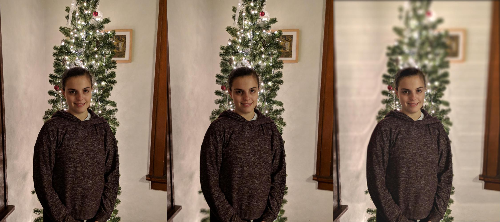

## Motivation
Camera systems embedded in many consumer electronics like cell phones are generally smaller than traditional options. This reduced size in optics and sensor size puts limitations of the effective depth of field achievable, in result many of these systems are designed with a wider depth of field. Depth of field is critical in the artistic value of an image as it can be used as a powerful compositional tool in highlighting the subject matter or conversely obscuring unwanted parts of the image scene.

## Approach
In attacking this problem we will initially restrict ourselves to an image domain with human subjects. The rationale being that selfies and portraits make for a large share of images taken today. With an increasingly connected society the issue of having a strong and reputable social media presence has become even more common. Our intention is to address the matter of resource access inequality (i.e., having a quality camera or ability to hire professional photographers) by implementing a solution that requires minimal hardware or effort in the image capture phase but still produces quality results comparable to professional images. Additionally, in implementing a software solution to this problem we eliminate the need for costly hardware systems.

## Implementation
Our approach will use the segmentation technique given by Wadhwa et al.15 as it is most adaptable to any imaging system which aligns with our general goal of being a hardware independent system. We use a Viola-Jones algorithm based on Haar feature to locate faces mean-shift image segmentation to separate a human subject from the background of an image. The mean-shift segmentation is over a five dimensional feature space composed of the L*a*b colorspace and spacial coordinates. After segmentation we will rely on reasonable assumptions about image composition that should more in most cases. Namely that the human subject will be in the foreground and that all other parts will be behind the subject. In addition, if we have segments that are at different vertical heights along the image, the ones closer to the top will be assumed to be further from the camera as is true with a distant horizon or sky. Segmentation is limited in how many objects it can discern so we will also use Gaussian interpolation as suggested by Nayar et al. as a way of increasing the depth-resolution. Finally the image is blurred for each depth in the generated depth-map and stacked into a final composited image. This blurring technique employs a convolutional filter with a dynamically generated kernel based on depth value.

Our system is completely modular in that the subject detection, segmentation, depth map generation, and blurring all occur independent of one another. This gives the user flexibility in how an image is processed and what the final results will look like. It opens the field for a wide range of other applications. Switching the face-recognition step with another object detection system (i.e. training a neural network to detect dogs) would allow the system to produce quality blurred photos of non-human subject. Additional depth-map calculation techniques like depth from focus/defocus with images gathered from short video segments with changing focus or implementing an algorithm to gather depth from stereo can be used to increase the accuracy and precision of the depth map. The blur kernel generator can be adjusted to produce non-circular bokeh in the final image.

The following image presents the steps of the process:

## Results

The images in the table below are some sample output:

 |  | 
-- | -- | --

The images presented below from left to right are as follows: the original unedited photo, the output by Google's portrait mode, the output from our approach. As you can see, Google's portrait mode was more conservative in what it chose to defocus, the most noticeable effects being the branches near the bottom of the photo and the wooden trim on the right of the image. Our approach is more aggressive and has mostly just the intended subject in focus. It does, however, produce some strange horizontal artifacts possibly due to the blur kernel used but more research needs to be done on that front.

We can render an image too if the depth map has already been calculated for us:

## Further considerations
One of the main problems we faced was that the facial recognition system we had in place was not working totally correct.  In fixing this, we decided to use images that contained fewer features in the background making it less difficult for the recognition system to pick up valid data.

Noisy pictures also led to issues with the image segmentation. Initially our approach used a k-means segmentation algorithm but the results were not desirable with busy backgrounds and we switched to a mean-shift algorithm instead.

In generating a depth map from the segmented image and face data our approach assumed that any segments directly below the eyes and face center would be part of the torso. This naïve approach to selecting the body created a lot of false positives and produced an inaccurate depth-map.
